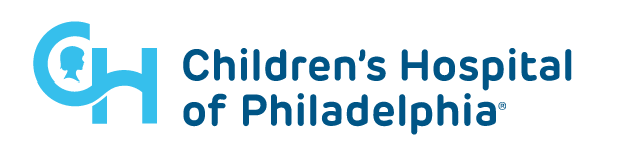

# About Me

I'm a third year undergraduate student at the University of Florida with a strong focus in computer graphics. I began teaching myself visual effects at 14 using After Effects and Blender, which eventually led to founding <a href="https://www.effxcts.com" target="_blank">Effxcts LLC</a>— a sports VFX company with 50M+ views and clients including ESPN, NHL, Red Bull, the Dallas Mavericks, and more.

In college, my interests expanded to coding, image processing, computer vision, and the broader field of visual computing. This past summer, I interned as a Machine Learning Software Engineer at the <a href="https://www.chop.edu/" target="_blank">Children's Hospital of Philadelphia</a> (CHOP), where I applied machine learning and image processing to predict surgical necessity from kidney scans.

Currently, I’m working on publishing those results, researching at the <a href="https://www.cise.ufl.edu/~eragan/indie.html" target="_blank">Indie Lab</a>, exploring new projects in computer graphics, and seeking a summer 2025 internship to continue contributing to this field.

Outside of this, I play basketball, flag football, and ski.

 

## Current Interests
3D Reconstruction, Diffusion Models, Gaussian Splatting, Pose Estimation

### Pose Estimaton for Automatic Video Creation
Building a program that automatically selects and edits a <a href="https://x.com/ari_fararooy/status/1604536193227427841" target="_blank">series of photos into a video</a>, utilizing web scraping, pose estimation, computer vision, image segmentation, and generative diffusion models for inpainting.

 

## Past Projects
### Deep Learning and Image Processing in Medicine
During my CHOP internship, I developed an image processing pipeline to extract quantitative data from hundreds of kidney scans. I trained and validated machine learning models, including a convolutional neural network with long short-term memory (CNN-LSTM), to predict surgical necessity in affected patients. To facilitate clinical use, I created two web-based tools using REST APIs. Manuscript is now being prepared for submission, further details available upon request.

 

### Basketball Shot Tracker - ML & Computer Vision
I developed a real-time basketball shot tracker by training a YOLOv8 deep learning model and implementing data-cleaning algorithms. The project achieved 95% score detection accuracy and 97% shot attempt accuracy.

<a href="https://github.com/avishah3/AI-Basketball-Shot-Detection-Tracker" target="_blank">GitHub Project</a>

  
  

 

### 3D Depth Screen Illusion - Computer Vision
I created an algorithm that adjusts 2D layers based on real-time eye tracking data to simulate 3D depth on a 2D screen.

<a href="https://github.com/avishah3/3D-Screen-Illusion-Using-Webcam" target="_blank">GitHub Project</a>

  
  

 

### NBA Blender 3D Data Visualization
I developed a GUI to visualize NBA player shooting heat maps using data from the NBA API. I then extended this into a 3D visualization, scripting 500 models to follow physics-based shooting arcs in Blender. This project reached over 4 million views on TikTok and Instagram.

<a href="https://github.com/avishah3/DSA-final-project" target="_blank">GitHub Project</a>
 
<a href="https://www.instagram.com/effxcts/reel/C1a-GdfgVMk/" target="_blank">Video Link</a>

  
  

 
